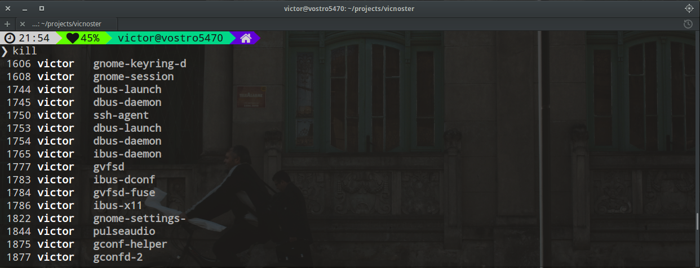
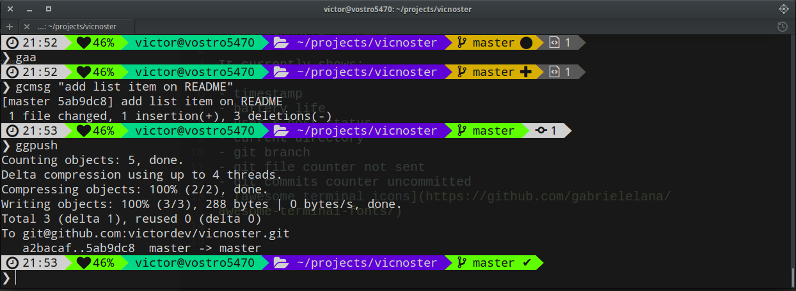

## vicnoster is a [oh-my-zsh](https://github.com/robbyrussell/oh-my-zsh) theme based on the [Powerline Vim](https://github.com/Lokaltog/vim-powerline) plugin & [Agnoster](https://github.com/robbyrussell/oh-my-zsh/wiki/themes#agnoster) theme.

It currently shows:

- timestamp
- battery life
- user & host status
- current directory
- git branch
- git file counter not sent
- git commits counter uncommitted
- [awesome terminal icons](https://github.com/gabrielelana/awesome-terminal-fonts/)

## Previews




## How to install

1. install [awesome terminal icons](https://github.com/gabrielelana/awesome-terminal-fonts/)

2. select a monospaced font from your system to you installed
	* in Ubuntu install Ubuntu Tweak tool to change the font

3. install [vicnoster zsh theme](https://github.com/victordev/vicnoster) in your themes folder`~/.oh-my-zsh/themes/` 

	```
	$ curl -o ~/.oh-my-zsh/themes/vicnoster.zsh-theme https://raw.githubusercontent.com/victordev/vicnoster/master/vicnoster.zsh-theme
	```
4. select the theme vicnoster in your `.zshrc` file

	* open the `.zshrc` file
	
	```
	$ vim ~/.zshrc
	```
	* find `ZSH_THEME` and change to:
	
	```
	ZSH_THEME="vicnoster"
	```
5. reload `.zshrc`

```
$ source ~/.zshrc
```


